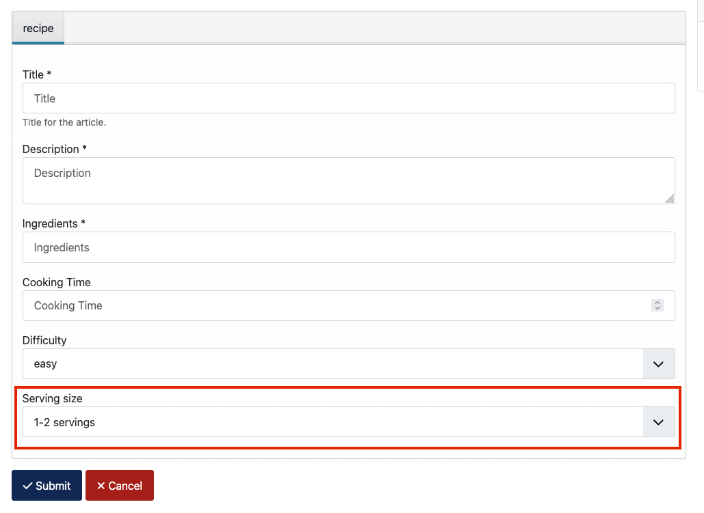
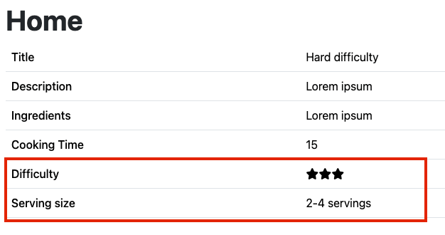
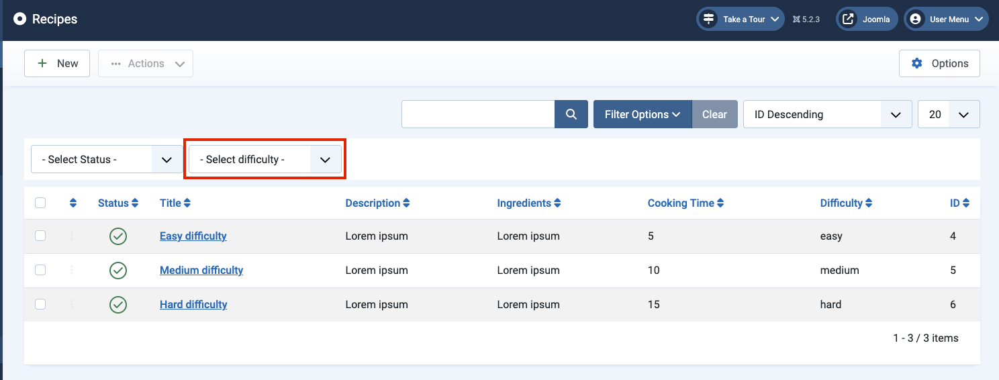
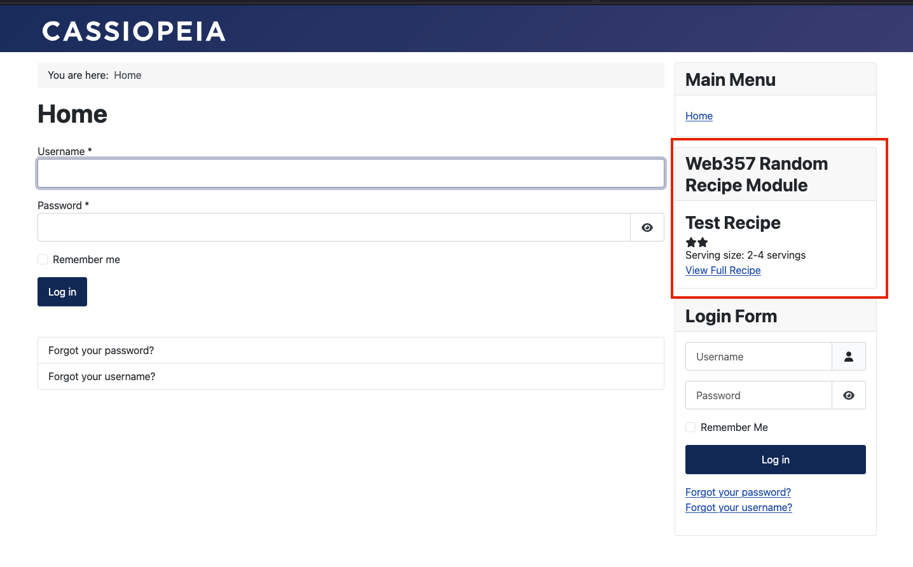

# Web357 Test

### Create ZIP Package for Joomla!

Install the necessary dependencies

```bash
npm install
```

Build the package

```bash
npm run build
```

## Installation

- Download `web357-candidate-test.zip`
- Go to your Joomla! Backend in `System -> Extensions -> Upload Package File`
- Upload `web357-candidate-test.zip`
- Enjoy the component in `Components -> Web357 Test -> Recipes`
- Configure the module in `Modules -> Web357 Random Recipe Module`

## Changelog

Read [CHANGELOG.md](CHANGELOG.md)

## New Features

### 🚨 New parameter `Serving size` for Recipe in the administrator form


### 🚨 New parameter `Serving size` for Recipe in frontend form



### 🚨 Display serving size and difficulty levels as stars in the frontend recipe list and single page view




### 🚨 New filter "Difficulty" in the administrator Recipe list



### 🚨 New "Random Recipe Module" for frontend



## Testing

### Installation

To install the necessary dependencies, run:

```bash
npm install
```

### Setting Up the Test Environment

#### Option 1: Docker Test Environment (Recommended)

You can start the Docker test environment by running

```bash
npm run docker:up
```

#### Option 2: Manual Configuration

If you prefer to configure your environment manually, copy the `tests/cypress/cypress.env.json` file to the root folder
and update it with your configuration:

```json
{
  "baseUrl": "http://joomla-installation.local",
  "adminUsername": "joomla",
  "adminPassword": "joomla@password"
}
```

### Running Tests

#### Run Tests via Cypress CLI

To execute the tests using the Cypress CLI, use:

```bash
npm run cypress:cli
```

#### Open Cypress in Interactive Mode

To open Cypress in interactive mode, run:

```bash
npm run cypress:open
```
